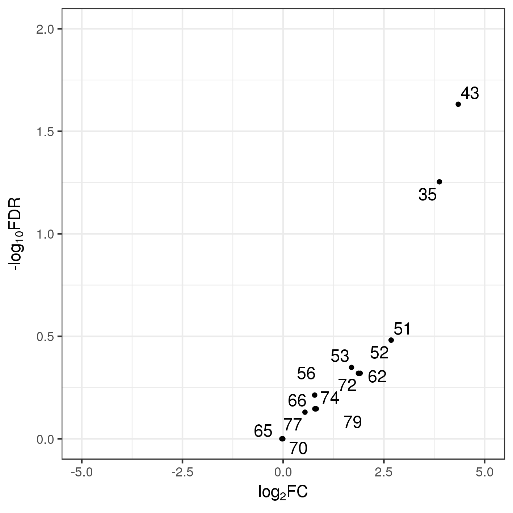

```
-----------A-----A------A-A-A-A
...<<------T-----T------T-T-T-T
           *     *             
positions  35    43

* = 0, 12, 25 and 50% level of incorporation hmU/T

in the reverse strand - check T->C conversion:

- hmU --(hmU-seq)--> fU --(read as)--> C
- T --(hmU-seq)--> T --(read as)--> T

in the forwad strand - check A->G conversion:

- hmU --(hmU-seq)--> fU --(read as)--> G
- T --(hmU-seq)--> T --(read as)--> A
```

- 0% incorporation libraries:
  - F7-148-0-1   ox   id:170911-BF7LK-47486441   (Fig. 2a)
  - F7-148-0-2   ox   id:170911-BF7LK-47486441   (Fig. 2a)
  - F7-148-0-3   ox   id:170911-BF7LK-47486441   (Fig. 2a)

- 12% incorporation libraries:
  - F7-148-12-1   ox   id:170911-BF7LK-47486441   (Fig. 2a)
  - F7-148-12-2   ox   id:170911-BF7LK-47486441   (Fig. 2a)
  - F7-148-12-3   ox   id:170911-BF7LK-47486441   (Fig. 2a)

- 25% incorporation libraries:
  - F7-148-25-1   ox   id:170911-BF7LK-47486441   (Fig. 2a)
  - F7-148-25-2   ox   id:170911-BF7LK-47486441   (Fig. 2a)
  - F7-148-25-3   ox   id:170911-BF7LK-47486441   (Fig. 2a)
  - F8-6-M7v2-25pct-ox-1   ox   id:180109_M00886_0188_000000000_BGP8K   (Fig. 2b)
  - F8-6-M7v2-25pct-ox-2   ox   id:180109_M00886_0188_000000000_BGP8K   (Fig. 2b)
  - F8-6-M7v2-25pct-ox-3   ox   id:180109_M00886_0188_000000000_BGP8K   (Fig. 2b)
  - F8-6-M7v2-25pct-nooxctrl-1   nooxctrl   id:180109_M00886_0188_000000000_BGP8K   (Fig. 2b)
  - F8-6-M7v2-25pct-nooxctrl-2   nooxctrl   id:180109_M00886_0188_000000000_BGP8K   (Fig. 2b)
  - F8-6-M7v2-25pct-nooxctrl-3   nooxctrl   id:180109_M00886_0188_000000000_BGP8K   (Fig. 2b)

- 50% incorporation libraries:
  - F7-148-50-1   ox   id:170911-BF7LK-47486441   (Fig. 2a)
  - F7-148-50-2   ox   id:170911-BF7LK-47486441   (Fig. 2a)
  - F7-148-50-3   ox   id:170911-BF7LK-47486441   (Fig. 2a)


## Software requirements
Essential:
- Standard unix tools: mv, mkdir, cd, echo ...
- [FastQC v0.11.3](https://www.bioinformatics.babraham.ac.uk/projects/fastqc/)
- [cutadapt v1.12](http://cutadapt.readthedocs.io/en/stable/guide.html)
- [bwa v0.7.15-r1140](http://bio-bwa.sourceforge.net/)
- [samtools v1.3.1](http://samtools.sourceforge.net/)
- [bedtools v2.26.0](http://bedtools.readthedocs.io/en/latest/)
- [pysamstats v1.0.1](https://github.com/alimanfoo/pysamstats) (pysam 0.11.2.2)
- [python v2.7.12](https://www.python.org/). Libraries:
  - [os](https://docs.python.org/2/library/os.html)
- [R v3.3.2](https://www.r-project.org/). Libraries:
  - [data.table](https://cran.r-project.org/web/packages/data.table/index.html)
  - [edgeR](http://bioconductor.org/packages/release/bioc/html/edgeR.html)
  - [ggplot2](http://ggplot2.org/)
  - [ggrepel](https://cran.r-project.org/web/packages/ggrepel/index.html)

Optional:
- [slurm](https://slurm.schedmd.com/overview.html) cluster job scheduling system


## Processing sequencing reads

### Renaming fastq files

Adding the sequencing run id (180109_M00886_0188_000000000_BGP8K) to the file name.

```bash
cd fastq # fastq = directory containing the *.fastq.gz files shown above

id=180109_M00886_0188_000000000_BGP8K # or 170911-BF7LK-47486441 - see above

for fastq in *.fastq.gz
do
  mv $fastq $id_$fastq
done
```


### Quality check

```bash
mkdir ../fastqc

for fq in *.fastq.gz
do
  bname=${fq%_L001_R1_001.fastq.gz}
  sbatch -J $bname -o ../fastqc/$bname.log --mem 4096 --wrap "fastqc --noextract --nogroup -q -o ../fastqc $fq"
done
```


### Trim Illumina adaptors

```bash
mkdir ../fastq_trimmed

for fq in *.fastq.gz
do
  bname=${fq%_L001_R1_001.fastq.gz}
  sbatch -J $bname -o ../fastq_trimmed/$bname.log --mem 4096 --wrap "cutadapt -a AGATCGGAAGAGC -m 15 -q 20 -o ../fastq_trimmed/$fq $fq > ../fastq_trimmed/$bname.txt"
done
```


## Alignment

### Prepare and index reference template

```bash
mkdir ../reference
cd ../reference
echo -e ">template\nGCTCGCTTTGTTGGTTTCCTTGTTCTCTGTGCCCACTGCCTGACGGGCGGAAAGCAGCGCGAGCAAGCGAGACAGGACAC" > template.fa
bwa index template.fa
```


### Align, convert to bam, sort, index and flagstat

```bash
cd ../fastq_trimmed
mkdir ../bam
mkdir ../flagstat

ref=../reference/template.fa

for fq in *_L001_R1_001.fastq.gz
do
  bname=${fq%_L001_R1_001.fastq.gz}
  sbatch -J $bname -o ../bam/$bname.log --mem 8192 --wrap "bwa mem -k 5 -T 10 -L 200 -t 20 -M $ref $fq | \
  samtools view -@ 20 -b - | \
  samtools sort -@ 20 -T ~/tmp/$bname -o ../bam/$bname.bam - &&
  samtools index ../bam/$bname.bam &&
  samtools flagstat ../bam/$bname.bam > ../flagstat/$bname.txt"
done
```


## Counting (id:170911-BF7LK-47486441 files)

### pysamstats

```bash
cd ../bam
mkdir ../pysamstats

ref=../reference/template.fa

for bam in 170911-BF7LK-47486441*.bam
do
  bname=${bam%.bam}
  sbatch -J $bname -o ../pysamstats/$bname.log --mem 8192 --wrap "pysamstats --type variation_strand -d -D 1000000 -f $ref $bam > ../pysamstats/$bname.txt"
done
```


### tables

Create output directory:

```bash
mkdir ../tables
```

Parsing pysamstats output to extract A_rev and G_rev:

```python
import os

files = [f for f in os.listdir("../pysamstats/") if '.txt' in f]

file_pos_counts = {}

for f in files:
  id = f.split('_')[1]
  ifile = open("../pysamstats/%s" % f , 'r')
  ilines = ifile.readlines()
  ifile.close()
  for line in ilines[1:]:
    fields = line.split()
    pos = fields[1]
    base = fields[2]
    a_rev = fields[35]
    g_rev = fields[53]
    if base == 'A':
      file_pos_counts[(id+'-T', pos)] = a_rev
      file_pos_counts[(id+'-C', pos)] = g_rev


inc = ['0', '6', '12', '25', '50']

for i in inc:
  columns = sorted(list(set([pair[0] for pair in file_pos_counts.keys() if '-%s-' % i in pair[0]])))
  rows = sorted(list(set([pair[1] for pair in file_pos_counts.keys() if '-%s-' % i in pair[0]])))
  ofile = open("../tables/%s.txt" % i, "w")
  ofile.write("pos\t" + "\t".join(columns) + "\n")
  for r in rows:
    ofile.write("%s\t" % r)
    ofile.write("\t".join([file_pos_counts[(c,r)] for c in columns]) + "\n")
  ofile.close()
```


## Sample bam files to 100x (id:180109_M00886_0188_000000000_BGP8K files)

```bash
cd ../bam
mkdir 100x

for bam in 180109_M00886_0188_000000000_BGP8K*.bam
do
  bname=${bam%.bam}
  for i in `seq 1 3`
  do
    sbatch -J ${bname}_sample${i} -o 100x/${bname}_sample${i}.log --mem 8192 --wrap "bedtools sample -i $bam -seed $i -n 100 -s reverse | \
    samtools sort -@ 20 -T /scratchb/sblab/martin03/tmp/${bname}_sample${i} -o 100x/${bname}_sample${i}.bam - && \
    samtools index 100x/${bname}_sample${i}.bam"
  done
done
```


## Counting (id:180109_M00886_0188_000000000_BGP8K files)

### pysamstats

```bash
cd ../bam/100x
mkdir ../../pysamstats/100x

ref=../../reference/template.fa

for bam in *.bam
do
  bname=${bam%.bam}
  sbatch -J $bname -o ../../pysamstats/100x/$bname.log --mem 8192 --wrap "pysamstats --type variation_strand -d -D 1000000 -f $ref $bam > ../../pysamstats/100x/$bname.txt"
done
```


### tables

Parsing pysamstats output to extract A_rev and G_rev:

```python
import os

files = [f for f in os.listdir("../pysamstats/100x") if '.txt' in f]

file_pos_counts = {}

for f in files:
  id = "_".join([f.split('_')[-3], f.split('_')[-1].replace(".txt", "")])
  ifile = open("../pysamstats/100x/%s" % f , 'r')
  ilines = ifile.readlines()
  ifile.close()
  for line in ilines[1:]:
    fields = line.split()
    pos = fields[1]
    base = fields[2]
    a_rev = fields[35]
    g_rev = fields[53]
    if base == 'A':
      file_pos_counts[(id+'-T', pos)] = a_rev
      file_pos_counts[(id+'-C', pos)] = g_rev


inc = [('12', '12pct'), ('25', '25pct')]

for i in inc:
  columns = sorted(list(set([pair[0] for pair in file_pos_counts.keys() if ('-%s-' % i[0] in pair[0]) or ('-%s-' % i[1] in pair[0])])))
  rows = sorted(list(set([pair[1] for pair in file_pos_counts.keys() if ('-%s-' % i[0] in pair[0]) or ('-%s-' % i[1] in pair[0])])))
  ofile = open("../tables/%s_e2_100x.txt" % i[0], "w")
  ofile.write("pos\t" + "\t".join(columns) + "\n")
  for r in rows:
    ofile.write("%s\t" % r)
    ofile.write("\t".join([file_pos_counts[(c,r)] for c in columns]) + "\n")
  ofile.close()
```


## Analysis

Having a look at 25_e2_100x.txt:

```r
library(data.table)
library(edgeR)
library(ggplot2)
library(ggrepel)

# Enlarge the view width when printing tables
options(width = 300)

#######
# 25% #
#######

# Load data
data_25 <- fread("../tables/25_e2_100x.txt")

# Create DGEList object
data_25 <- DGEList(counts = data_25[,-1], group = c("c", "c", "c", "c", "c", "c", "c", "c", "c", "c", "c", "c", "c", "c", "c", "c", "c", "c", "t", "t", "t", "t", "t", "t", "t", "t", "t", "t", "t", "t", "t", "t", "t", "t", "t", "t"), samples = data.frame(t2c = rep(c("C", "T"), 18)), genes = data_25[,1])
data_25_m <- data_25
data_25_m$samples$lib.size <- as.vector(rep(tapply(data_25_m$samples$lib.size, rep(1:(length(data_25_m$samples$lib.size)/2), each=2)[1:(length(data_25_m$samples$lib.size))], FUN=sum), each = 2))
data_25_m$samples$t2c <- factor(data_25_m$samples$t2c, levels = c("T", "C"))

# Set up design matrix for GLM
des <- model.matrix(~ group + t2c, data = data_25_m$samples)
colnames(des) <- gsub("group", "", colnames(des))
colnames(des) <- gsub("C", "", colnames(des))
colnames(des)[1] <- "Int"
des <- cbind(des, t2c_2 = c(0,0,0,0,0,0,0,0,0,0,0,0,0,0,0,0,0,0,1,0,1,0,1,0,1,0,1,0,1,0,1,0,1,0,1,0))
des

# Estimate dispersion
data_25_m <- estimateDisp(data_25_m, design = des, trend="none")
data_25_m$common.dispersion # 9.765625e-05

# Fit negative bionomial GLM
data_25_m_fit <- glmFit(data_25_m, des)
data_25_m_fit$AveLogCPM <- aveLogCPM(data_25)

# Carry out Likelihood ratio tests
data_25_m_lrt <- glmLRT(data_25_m_fit, coef = 4)

# Top ranked positions
data.table(as.data.frame(topTags(data_25_m_lrt, n = Inf)))
#pos       logFC   logCPM           LR       PValue         FDR
#1:  35  2.92294075 16.22988 1.974987e+01 8.826784e-06 0.000123575
#2:  43  2.86244507 16.18259 1.361645e+01 2.242123e-04 0.001569486
#3:  51  2.86620055 16.17240 9.731133e+00 1.811728e-03 0.008454730
#4:  72  2.25536468 16.17664 7.333524e+00 6.768022e-03 0.023688078
#5:  79  1.79530805 16.14446 6.808263e+00 9.073698e-03 0.025406353
#6:  62  1.39115750 16.15415 2.967562e+00 8.494980e-02 0.198216196
#7:  56  0.83162211 16.23447 2.183975e+00 1.394539e-01 0.257463966
#8:  53  1.19661629 16.17637 2.101837e+00 1.471223e-01 0.257463966
#9:  65  0.89620564 16.13579 1.368759e+00 2.420253e-01 0.376483753
#10:  52  0.96023413 16.16255 1.046453e+00 3.063253e-01 0.397436143
#11:  77  0.79274819 16.13929 1.021045e+00 3.122713e-01 0.397436143
#12:  74  0.57741004 16.17325 6.967830e-01 4.038668e-01 0.471177888
#13:  70  0.39847033 16.17927 3.191334e-01 5.721289e-01 0.616138793
#14:  66 -0.01377558 16.16983 2.070564e-04 9.885193e-01 0.988519272

data.table(as.data.frame(topTags(data_25_m_lrt, n = Inf)))[order(-logFC)]

# Volcano plot
gg <- ggplot(data = data.table(as.data.frame(topTags(data_25_m_lrt, n = Inf))), aes(x = logFC, y = -log10(FDR))) +
geom_point(size = 1) +
theme_bw() +
xlab(expression("log"[2]*"FC")) +
ylab(expression("-log"[10]*"FDR")) +
geom_text_repel(data = data.table(as.data.frame(topTags(data_25_m_lrt, n = Inf))), aes(label = pos), size = 4, force = 1, segment.size = 0) +
coord_cartesian(xlim = c(-4, 4), ylim = c(0, 5))

ggsave('../figures/20180111_hmUseq_oligos_F8-6-M7v2-25pct_100x.png', width = 12, height = 12, units= 'cm')


#######
# 25% #
#######
#only samples:
#F8-6-M7v2-25pct-nooxctrl-1_sample3 6,7
#F8-6-M7v2-25pct-nooxctrl-2_sample2 10,11
#F8-6-M7v2-25pct-nooxctrl-3_sample2 16,17
#F8-6-M7v2-25pct-ox-1_sample2 22,23
#F8-6-M7v2-25pct-ox-2_sample2 28,29
#F8-6-M7v2-25pct-ox-3_sample1 32,33

# Load data
data_25 <- fread("../tables/25_e2_100x.txt")

# Create DGEList object
data_25 <- DGEList(counts = data_25[,c(6,7,10,11,16,17,22,23,28,29,32,33)], group = c("c", "c", "c", "c", "c", "c", "t", "t", "t", "t", "t", "t"), samples = data.frame(t2c = rep(c("C", "T"), 6)), genes = data_25[,1])
data_25_m <- data_25
data_25_m$samples$lib.size <- as.vector(rep(tapply(data_25_m$samples$lib.size, rep(1:(length(data_25_m$samples$lib.size)/2), each=2)[1:(length(data_25_m$samples$lib.size))], FUN=sum), each = 2))
data_25_m$samples$t2c <- factor(data_25_m$samples$t2c, levels = c("T", "C"))

# Set up design matrix for GLM
des <- model.matrix(~ group + t2c, data = data_25_m$samples)
colnames(des) <- gsub("group", "", colnames(des))
colnames(des) <- gsub("C", "", colnames(des))
colnames(des)[1] <- "Int"
des <- cbind(des, t2c_2 = c(0,0,0,0,0,0,1,0,1,0,1,0))
des

# Estimate dispersion
data_25_m <- estimateDisp(data_25_m, design = des, trend="none")
data_25_m$common.dispersion # 9.765625e-05

# Fit negative binomial GLM
data_25_m_fit <- glmFit(data_25_m, des)
data_25_m_fit$AveLogCPM <- aveLogCPM(data_25)

# Carry out Likelihood ratio tests
data_25_m_lrt <- glmLRT(data_25_m_fit, coef = 4)

# Top ranked positions
data.table(as.data.frame(topTags(data_25_m_lrt, n = Inf)))
#pos        logFC   logCPM           LR      PValue        FDR
#1:  43  4.346011785 16.20773 9.884135e+00 0.001667099 0.02333938
#2:  35  3.878653892 16.20824 7.040872e+00 0.007967025 0.05576918
#3:  51  2.680184953 16.17322 2.799491e+00 0.094294220 0.33003030
#4:  52  2.680183104 16.17336 2.799489e+00 0.094294372 0.33003030
#5:  53  1.696973692 16.20672 1.973041e+00 0.160125469 0.44835131
#6:  62  1.910870032 16.14645 1.415408e+00 0.234160646 0.47864918
#7:  72  1.866682011 16.15346 1.384568e+00 0.239324590 0.47864918
#8:  56  0.782052506 16.27982 8.747125e-01 0.349653974 0.61189445
#9:  79  0.821951029 16.10744 3.633615e-01 0.546645235 0.71392783
#10:  74  0.800751030 16.15916 3.484080e-01 0.555015725 0.71392783
#11:  66  0.785868257 16.17553 3.380736e-01 0.560943293 0.71392783
#12:  77  0.541027248 16.14896 2.248876e-01 0.635340754 0.74123088
#13:  70 -0.008243737 16.16022 5.787993e-06 0.998080431 0.99959426
#14:  65 -0.031934845 16.13116 2.585866e-07 0.999594264 0.99959426

data.table(as.data.frame(topTags(data_25_m_lrt, n = Inf)))[order(-logFC)]
cbind(data_25$genes, data_25$counts)

# Volcano plot
gg <- ggplot(data = data.table(as.data.frame(topTags(data_25_m_lrt, n = Inf))), aes(x = logFC, y = -log10(FDR))) +
geom_point(size = 1) +
theme_bw() +
xlab(expression("log"[2]*"FC")) +
ylab(expression("-log"[10]*"FDR")) +
geom_text_repel(data = data.table(as.data.frame(topTags(data_25_m_lrt, n = Inf))), aes(label = pos), size = 4, force = 1, segment.size = 0) +
coord_cartesian(xlim = c(-5, 5), ylim = c(0, 2))

ggsave('../figures/20180111_hmUseq_oligos_F8-6-M7v2-25pct-nooxctrl-1_sample3_F8-6-M7v2-25pct-nooxctrl-2_sample2_F8-6-M7v2-25pct-nooxctrl-3_sample2_F8-6-M7v2-25pct-ox-1_sample2_F8-6-M7v2-25pct-ox-2_sample2_F8-6-M7v2-25pct-ox-3_sample1_100x.png', width = 12, height = 12, units= 'cm')

# Volcano plot in pdf - changing axes coordinates
gg <- ggplot(data = data.table(as.data.frame(topTags(data_25_m_lrt, n = Inf))), aes(x = logFC, y = -log10(FDR))) +
geom_point(size = 1) +
theme_bw() +
xlab(expression("log"[2]*"FC")) +
ylab(expression("-log"[10]*"FDR")) +
geom_text_repel(data = data.table(as.data.frame(topTags(data_25_m_lrt, n = Inf))), aes(label = pos), size = 4, force = 1, segment.size = 0) +
coord_cartesian(xlim = c(-0.5, 5), ylim = c(0, 1.75))

ggsave('../figures/20180111_hmUseq_oligos_F8-6-M7v2-25pct-nooxctrl-1_sample3_F8-6-M7v2-25pct-nooxctrl-2_sample2_F8-6-M7v2-25pct-nooxctrl-3_sample2_F8-6-M7v2-25pct-ox-1_sample2_F8-6-M7v2-25pct-ox-2_sample2_F8-6-M7v2-25pct-ox-3_sample1_100x.pdf', width = 12, height = 12, units= 'cm')
```



